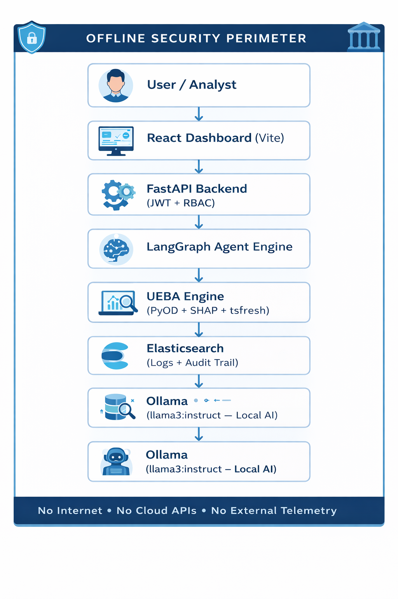

# 🏦 BankShield SOC  
## Banking-Grade Autonomous Cyber Incident Response Platform  
### Barclays Hackathon Submission

---

## 🎯 Executive Summary

BankShield SOC is a fully offline, AI-driven cyber incident response platform designed for regulated financial institutions. It combines UEBA-based anomaly detection, MITRE ATT&CK mapping, explainable AI (SHAP), and autonomous agent orchestration to reduce alert fatigue while preserving human supervisory authority.

The platform aligns with RBI cybersecurity guidelines and supports complete audit traceability for regulatory defensibility.

---

## 🚨 Problem Statement

Modern banks face:

- Alert fatigue from excessive false positives  
- Increasing fraud and account takeover attacks  
- Regulatory pressure for explainable AI  
- Mandatory breach reporting timelines (CERT-In – 6 hours)  
- Strict data residency and offline compliance requirements  

Traditional SIEM systems generate alerts but lack contextual AI-driven triage with regulatory audit readiness.

---

## 🚀 Solution Overview

BankShield SOC provides:

- ✅ UEBA-based anomaly detection (tsfresh + PyOD)  
- ✅ Fidelity scoring to reduce false positives  
- ✅ MITRE ATT&CK technique mapping  
- ✅ LangGraph multi-agent orchestration  
- ✅ AI-generated incident playbooks (Ollama – llama3:instruct, local inference only)  
- ✅ Mandatory supervisor approval workflow  
- ✅ Complete Elasticsearch audit trail  
- ✅ Fully offline operation (no cloud APIs)

---

## 🏦 Why This Matters for Barclays

- Reduces SOC analyst overload via fidelity-based prioritization  
- Preserves human-in-the-loop supervisory authority  
- Enables explainable AI (SHAP) for regulatory defensibility  
- Operates fully offline to satisfy data sovereignty constraints  
- Provides audit-ready incident evidence for compliance review  

---

## 🏗 Architecture Overview

## 📊 Architecture Diagram



### High-Level Flow

```
React Frontend (Dashboard)
        ↓
FastAPI Backend (JWT + RBAC)
        ↓
LangGraph Agent Orchestration
        ↓
UEBA Engine (PyOD + tsfresh + SHAP)
        ↓
Elasticsearch (Logs + Audit Trail)
        ↓
Ollama (llama3:instruct – Local AI Inference)
```

---

## 🔒 Offline Security Perimeter

```
┌─────────────────────────────────────────────────────────────┐
│                    OFFLINE PERIMETER                         │
│  ┌──────────┐   ┌──────────┐   ┌──────────┐   ┌──────────┐ │
│  │  React   │──▶│ FastAPI  │──▶│ LangGraph│──▶│  Ollama  │ │
│  │  (Vite)  │   │  (JWT)   │   │  Agent   │   │ (Local)  │ │
│  └──────────┘   └──────────┘   └──────────┘   └──────────┘ │
│       │              │               │                       │
│       │         ┌────▼────┐   ┌──────▼──────┐              │
│       │         │  PyOD   │   │Elasticsearch│              │
│       │         │  SHAP   │   │  (Logs +    │              │
│       │         │ tsfresh │   │  Audit)     │              │
│       └─────────└─────────┘   └─────────────┘              │
│                                                             │
│  ✗ No Internet  ✗ No Telemetry  ✗ No Cloud APIs            │
└─────────────────────────────────────────────────────────────┘
```

---

## 📊 Fidelity Scoring Model

```
Fidelity = 0.4 × anomaly_score
         + 0.2 × threat_intel_score
         + 0.2 × correlation_strength
         + 0.1 × mitre_severity
         + 0.1 × historical_similarity
```

### Decision Thresholds

| Fidelity Score | Action |
|---------------|--------|
| ≥ 0.90 | Critical Severity |
| ≥ 0.75 | High Severity (Agent Triggered) |
| ≥ 0.50 | Medium Severity |
| < 0.50 | Low Severity |

This significantly reduces false positives while prioritizing genuine risk.

---

## 📁 Project Structure

```
banking-soc-platform/
├── backend/
│   ├── main.py
│   ├── ingest.py
│   ├── analytics.py
│   ├── agent_graph.py
│   ├── tools_server.py
│   ├── mitre_mapper.py
│   ├── dedup.py
│   ├── audit_logger.py
│   └── requirements.txt
├── frontend/
├── data/
├── scripts/
└── README.md
```

---

## ⚙️ Setup Instructions

### Prerequisites

| Component | Version |
|-----------|----------|
| Python | 3.10+ |
| Node.js | 18+ |
| Elasticsearch | 8.x |
| Ollama | Latest |
| Docker (optional) | Any |

---

### 1️⃣ Start Elasticsearch

```bash
docker run -d \
  --name elasticsearch \
  -p 9200:9200 \
  -e discovery.type=single-node \
  -e xpack.security.enabled=false \
  -e ES_JAVA_OPTS="-Xms512m -Xmx512m" \
  elasticsearch:8.11.0
```

Verify:

```
curl http://localhost:9200
```

---

### 2️⃣ Install Ollama

```bash
ollama pull llama3:instruct
ollama run llama3:instruct
```

Verify:

```
curl http://localhost:11434/api/tags
```

---

### 3️⃣ Backend Setup

```bash
cd backend
py -3 -m venv venv
venv\Scripts\activate
pip install -r requirements.txt
uvicorn main:app --reload --port 8000
```

API Docs:

```
http://localhost:8000/docs
```

---

### 4️⃣ Frontend Setup

```bash
cd frontend
npm install
npm run dev
```

Application:

```
http://localhost:5173
```

---

## 🔐 RBAC Model

| Endpoint | Analyst | Supervisor | Auditor |
|----------|---------|------------|---------|
| /login | ✓ | ✓ | ✓ |
| /alerts | ✓ | ✓ | ✓ |
| /analyze | ✓ | ✓ | ✗ |
| /approve | ✗ | ✓ | ✗ |
| /audit | ✗ | ✓ | ✓ |

Supervisor approval is mandatory before automated playbook execution.

---

## 🏛 Regulatory Alignment

- RBI Cybersecurity Framework for Banks (2016)
- RBI Master Directions on NBFC-IT (2017)
- CERT-In 6-hour incident reporting mandate
- IT Act Section 72A
- MITRE ATT&CK framework
- AI Governance principles (Explainability + Auditability)

---

## 🧪 Testing

```bash
cd scripts
python test_platform.py
```

Health check:

```
curl http://localhost:8000/health
```

---

## 🏆 Differentiation from Traditional SIEM

Traditional SIEM:
- Generates alerts  
- Requires manual investigation  

BankShield SOC:
- Generates contextual AI analysis  
- Scores alert fidelity  
- Maps to MITRE  
- Produces explainable incident playbooks  
- Enforces supervisory approval  
- Operates fully offline  

---

## 🔐 Production Hardening Checklist

- Replace SECRET_KEY with secure 32-byte random key  
- Enable Elasticsearch TLS  
- Configure encrypted data-at-rest  
- Implement rate limiting  
- Configure outbound firewall restrictions  
- Enable WORM archival for audit logs  

---

## 📌 Conclusion

BankShield SOC demonstrates how AI-driven automation, explainable analytics, and regulatory compliance can coexist within a fully offline, banking-grade incident response platform.

It is designed specifically for high-regulation financial environments like Barclays.